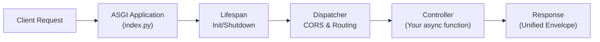

# 🏗️ Architectural Overview

DQuode is a **request–response backend** built on ASGI for high performance and predictability. Every request passes through a clear, unified pipeline:

<div style="text-align: center; margin: 2em 0;">
  

</div>

## 🔄 High-Level Request Flow

**ASGI App (`index.py`):**

- Receives every HTTP request and manages startup/shutdown (“lifespan”) events.

### Lifespan Management

**On startup:**

- `AppContext.init()` connects to databases (and Redis, if used)
- `Dispatcher.initRoutes()` preloads routes

**On shutdown:**

- `AppContext.shutdown()` cleans up resources

**Request Handling**

- Every request is wrapped in a `Request` object and handed to the Dispatcher.

**Dispatcher**

- Handles CORS (if enabled).
- Finds the correct route based on path and HTTP method.
- Calls the linked controller function.

**Controller**

- Receives the `Request` object.
- May validate input using `applyRules`/`trimApplyRules`.
- Uses Models for any needed database operations.
- Returns a response using the unified contract.

**Response**

- Output is always wrapped in a standard envelope:
  ```
  {
    "data": ...,
    "message": ...,
    "status": ...,
    "statuscode": ...
  }
  ```

---

### 🧩 Core Components

**Routing**

- Define routes in `views/endpoints.py` using `route(path, methods, handler)`.
- Use `routegroup(prefix, postfix)` to group routes.

**Models**

- Subclass `database.Database` (e.g. `MyModel(database.Database)`).
- Set `tablename` and call `setTable()`.
- Use the same simple API (`create`, `read`, `update`, `delete`) for [supported database systems](getting-started/supported-databases.md)

**Controllers**

- Async functions that take a `Request`, do validation and coordination, and return a response.

**Configuration**

- Use `.env` for environment variables (`getenv`).
- Central config in `config.CONFIG` / `getconfig`.
- Custom codes/messages/auth in `registers.py`.

_DQuode makes the whole data—logic—route—response journey visible, explicit, and easy to reason about. No hidden behaviors, just a clear backend stack._
