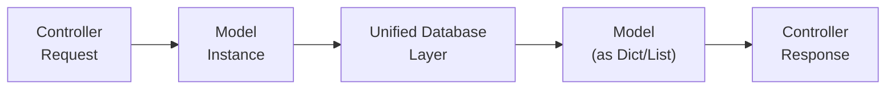
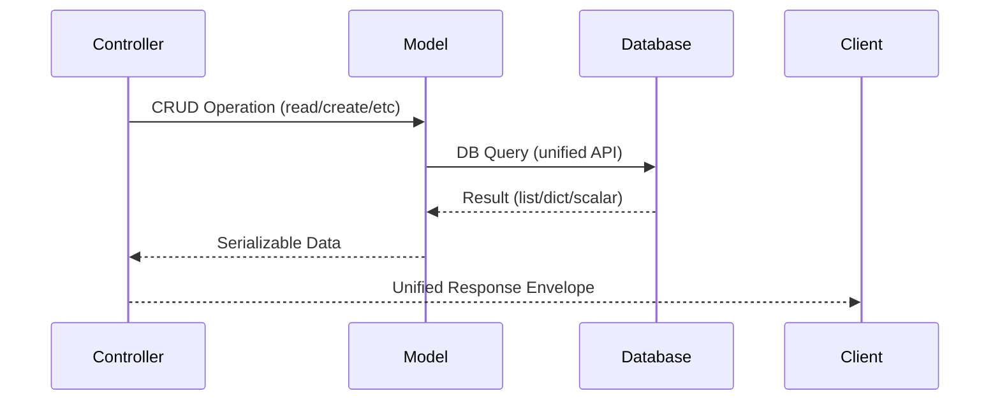

# 🔄 Query Execution Flow in DQuode

How does a database query travel from your controller, through models, to the database and back?  
Let’s clarify the path, spotlight the simplicity, and make the mechanism visually clear.

---

<div style="margin: 2em 0; text-align: center;">



</div>

---

## 🚦 Stepwise Flow

!!! info "Quick Steps — From Controller to Database (and Back)"

| Step                      | Description                                                                                                                                                                                                         |
| ------------------------- | ------------------------------------------------------------------------------------------------------------------------------------------------------------------------------------------------------------------- |
| **1. Model Boot**         | Controller instantiates a model (e.g., `SampleModel()`). The model sets up its table/collection with `self.setTable(self.tablename)`, leveraging the unified ORM.                                                   |
| **2. Database Routing**   | The model’s parent (`dreema.orm.database.Database`) inspects `getenv("DB_TYPE")` to pick the active database system from the list of [supported database systems](getting-started/supported-databases.md)           |
|  |
| **3. Single-API CRUD**    | The model exposes: <br> &nbsp;&nbsp;• `read(filters, params)`<br> &nbsp;&nbsp;• `create(data)`<br> &nbsp;&nbsp;• `update(filters, data)`<br> &nbsp;&nbsp;• `delete(filters)` <br>—each working the same across DBs. |
| **4. Consistent Results** | Model returns plain dicts, scalars, or lists—always serializable. <br> NO ORM objects, NO extra serialization headaches.                                                                                            |
| **5. Unified Response**   | Controller takes this data and returns it via the standard response envelope: <br>`response(data=...)`                                                                                                              |

---

## 💎 At a Glance:

- **Consistent API:** Same CRUD calls, no matter which database you use.
- **Backend-Agnostic:** Switch DBs by changing `.env` config—no code rewrite.
- **JSON-First:** Data returned is always ready for the client (no magic objects).
- **Clean Responsibility:**
  - Model: Shapes query, talks to DB.
  - Controller: Receives/query data, returns response.
- **No extra wiring:** Use `filters` and `params` the _same way_ everywhere ([see filter reference](../database/filters-and-params.md)).

---

## ✨ Example: One Query, Any Backend

```python
# Inside a controller (async function)
from models.sampleModel import SampleModel

model = SampleModel()
items = await model.read({"status": "active"}, {"limit": 10})

return response(data=items)
```

- Works identically whether [for all supported database systems](getting-started/supported-databases.md).
- `items` will always be a list of dicts—never a custom class or non-serializable type.

---

## 🗺️ Visual Recap



---

## 🔖 Summary

- **Invoke model CRUD** ➔ **let DQuode handle the rest**.
- Data flow is always:  
  **Controller ➔ Model ➔ Database ➔ Model ➔ Controller ➔ JSON Response**

No matter how your app scales or which supported database you switch to, your query execution path stays unified and fully predictable.
