# Request lifecycle

From the moment an HTTP request hits the server until the response is sent, the flow is:

## 1. ASGI receive

```mermaid
flowchart LR
    A["Client Request"] --> B["ASGI App (index.py) <br> <strong>1. ASGI receive</strong>"]
    B --> C["Lifespan <br> <strong>2. Startup/Shutdown</strong>"]
    C --> D["Request Construction <br> <strong>3. Build Request Object</strong>"]
    D --> E["Dispatcher <br> <strong>4. Match Route & CORS</strong>"]
    E --> F["Controller <br> <strong>5. Controller Execution</strong>"]
    F --> G["Unified Response <br> <strong>6. Envelope Returned</strong>"]
    G --> H["ASGI Response Sent"]
```

  

The ASGI server (uvicorn) receives the request and passes it to the app callable in `index.py`.

## 2. Lifespan (first request / startup)

Before handling requests, the app runs **lifespan**:

- **Startup** — `AppContext.init()` in `context.py` runs:
  - Connects the database (using `DB_TYPE`, `DB_HOST`, etc. from env).
  - Optionally connects Redis (if used).
  - Calls `Dispatcher.initRoutes(routes)` so all routes from your views are normalized and cached (e.g. “Routes: 5 cached”).
- **Shutdown** — When the app exits, `AppContext.shutdown()` closes DB and Redis.

Lifespan runs once per process; route caching happens at startup, not per request.

## 3. Request construction

The app builds a **Request** object from the ASGI scope and body. This object exposes:

- Path, method, headers, query.
- `request.body()` for parsed JSON/form body.
- `request.applyRules(...)` / `request.trimApplyRules(...)` for validation.

## 4. Dispatch

The app calls **Dispatcher.dispatchRoute(request)**:

- **CORS** — If CORS is configured, preflight and CORS headers are handled here.
- **Match** — The dispatcher looks up the request path and method in the cached routes (normalized path).
- **Handler** — If a route matches, the dispatcher calls the registered controller function with `request`.
- **No match** — Returns 404 (path not found) or 405 (method not allowed) with the same response envelope.

## 5. Controller execution

The controller (your async function):

- May validate body with `applyRules` / `trimApplyRules`.
- May check auth (framework does **not** enforce 401/403; controller must do it).
- Calls models for `create`/`read`/`update`/`delete`.
- Returns a response, typically via `response(data=..., message=..., status=..., statuscode=...)` or `response(..., custom=True)` for a custom envelope.

## 6. Response

The framework ensures the response has the unified shape (`data`, `message`, `status`, `statuscode`) and sends it back over ASGI with the correct HTTP status code.

So: **ASGI → Lifespan (once) → Request → Dispatcher → Controller → Response → ASGI**.
