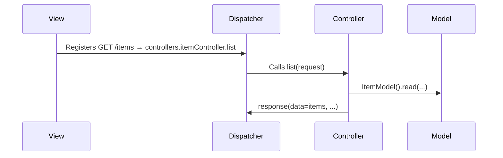

!!! info "MVC in DQuode – Practical Structure & Flow"

DQuode embraces a clear **MVC** (Model–View–Controller) pattern to separate concerns and boost clarity:

---

### 🟦 Model

- **Location:** `models/` (e.g. `models/sampleModel.py`)
- **Base:** Inherits from `database.Database` (from `dreema.orm.database`)
- **Setup:** Sets `tablename` and calls `self.setTable(self.tablename)` within `__init__`
- **API:** Unified methods for MySQL & Mongo: `create`, `read`, `update`, `delete` (see [Database operations](../database/read.md) for details)

**Model responsibility:**  
Defines the data table/collection name, enables CRUD operations, and shapes filter/params—never handles requests or responses.

---

### 🟩 View

- **Location:** `views/` (e.g. `views/endpoints.py`)
- **Content:** Exports a list of routes using `route(path, methods, handler)` from `dreema.routing.clients`
- **Extras:** Use `routegroup(prefix, postfix)` to organize related routes
- **No logic:** Does **not** contain business rules; solely maps paths/methods to controllers

**View responsibility:**  
Declares which URLs and HTTP methods trigger which controller functions.

---

### 🟧 Controller

- **Location:** `controllers/` (e.g. `controllers/sampleController.py`)
- **Nature:** Async functions taking a `Request` and returning a unified `Response` (`response(...)`)
- **Features:**
  - Use `request.body()` for input
  - Validate data with `request.applyRules(...)` / `request.trimApplyRules(...)`
  - Coordinate with Models for CRUD
  - Set response codes/messages, and use `SysCodes`/`SysMessages` (or custom codes in `registers`)

**Controller responsibility:**  
Handles input parsing, validation, orchestrates model actions, applies authentication, and returns a standardized response envelope.

---

### 🔄 End-to-End Data Flow

- **View:** Declares the route and HTTP method mapping.
- **Dispatcher:** Resolves the correct controller for an incoming request.
- **Controller:** Orchestrates validation and business logic, interacts with the Model, and forms the response.
- **Model:** Handles all database communication, whether MySQL or Mongo.

---

**Summary:**

- **View:** Routing map
- **Controller:** Request handler + orchestration
- **Model:** Data access

DQuode’s MVC makes code predictable, testable, and easy to extend—so you can focus on features, not boilerplate.
